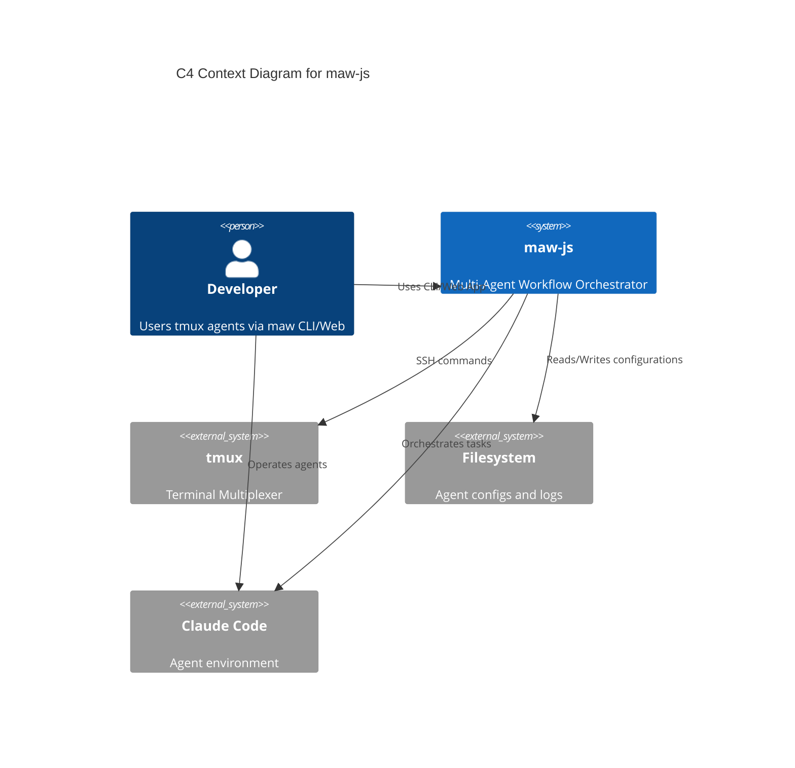
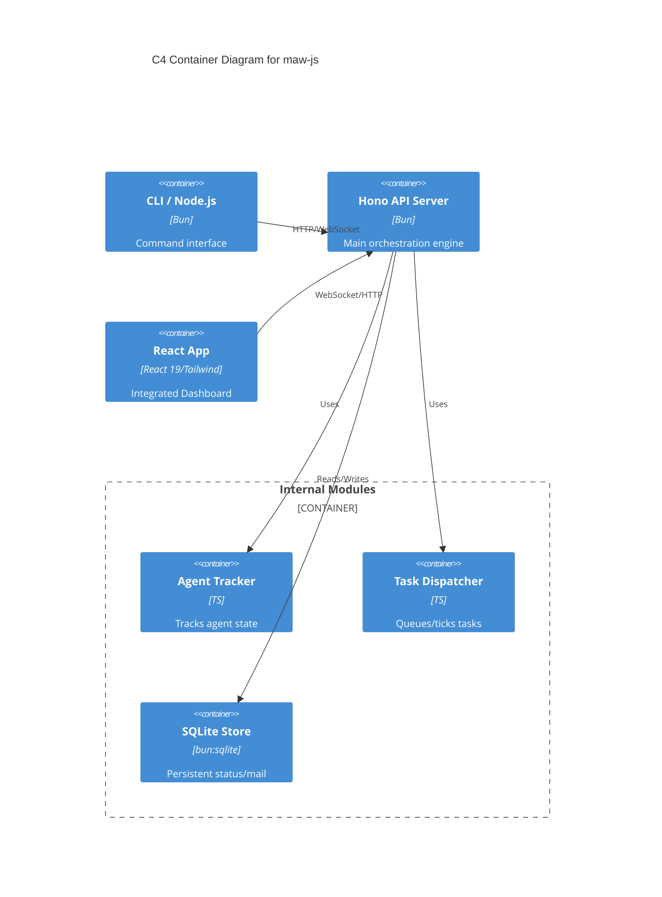

# Phase 2 Architecture: maw-js Improvement Project

## 1. Current Architecture Analysis

### C4 Context Diagram


### C4 Container Diagram


## 2. Target Architecture
- **Consolidation**: Move to single-SPA architecture (React 19).
- **Security**: Centralized middleware for path traversal checks.
- **Config**: Environment variable-driven (avoiding home/root assumptions).

### Proposed Directory Structure
```text
/src
  /api          # Hono routes (v2)
  /core         # Dispatcher, Tracker
  /db           # Store layer (SQLite)
  /services     # SSH, Filesystem interface
  /types        # Shared contracts (/src/types/*.ts)
  /ui           # Consolidated React components (/src/ui/App.tsx)
  /middleware   # Auth, Path security
/tests          # Unit tests (Bun test runner)
  /core
  /middleware
```

## 3. Type System Design
- **Integration**: Shared types will be located in `/src/types/`.
- **Key Extraction**:
    - `Task`, `TaskChain`, `TaskAffinity` (from `dispatcher.ts`).
    - `TrackedAgent`, `AgentStatus`, `AgentContext` (from `agent-tracker.ts`).
    - `QueueStatus`.
- **Contracts**: Backend to front-end communication via typed JSON messages over WebSockets.

## 4. Testing Architecture
- **Framework**: Bun's native test runner (`bun test`).
- **Structure**: Mirror `src/` (e.g., `src/core/dispatcher.ts` → `tests/core/dispatcher.test.ts`).
- **Mocks**:
    - `ssh.ts`: Mock SSH with a dummy executor.
    - `store.ts`: In-memory SQLite for ephemeral test runs.
- **Targets**: 80% coverage on `/src/core/`, `/src/middleware/`, and `/src/store.ts`.

## 5. Security Architecture
- **Path Validation**: Middleware at `/src/middleware/path-validator.ts` ensuring all filesystem access is confined to project roots.
- **Config**: All environment-specific paths (DB_DIR, AGENTS_DIR) extracted to `env` variables with defaults to `./data` instead of absolute paths like `/root`.

## 6. UI Consolidation Plan
- **Migration**: Replace `ui.html`, `dashboard.html` with centralized React `App.tsx` (using Vite).
- **Consolidation**: Move `office/src` components up to `src/ui/`.
- **State**: Centralize state management using React Context/Hooks, driven by the WebSocket stream.

## 7. Performance & DB
- **WebSocket**: Retain 50ms capture interval (as optimized in `server.ts`).
- **SQLite**: Implement WAL mode and periodic checkpointing:
  ```typescript
  // store.ts logic
  db.run("PRAGMA journal_mode = WAL");
  db.run("PRAGMA wal_checkpoint(TRUNCATE)");
  ```

## 8. ADRs
- **ADR-001: Test Runner**: Bun built-in (`bun test`) chosen for performance and native integration.
- **ADR-002: Type System**: Strict TS with shared `/src/types/` for contract safety.
- **ADR-003: UI Consolidation**: Migrate to a unified Vite React SPA.
- **ADR-004: Security**: Dedicated `path-validator` middleware for all `open-file` or `upload` requests.

## 9. Tech Stack Confirmation
- **Core**: Bun + TypeScript.
- **Framework**: Hono, React 19, Tailwind v4.
- **Database**: SQLite (built-in).
- **Validation**: Zod (for API route schema validation).
