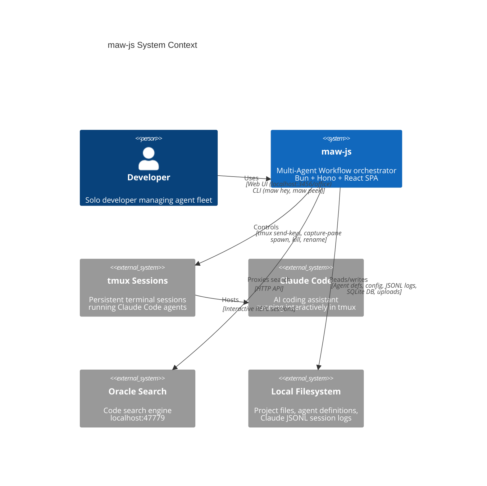
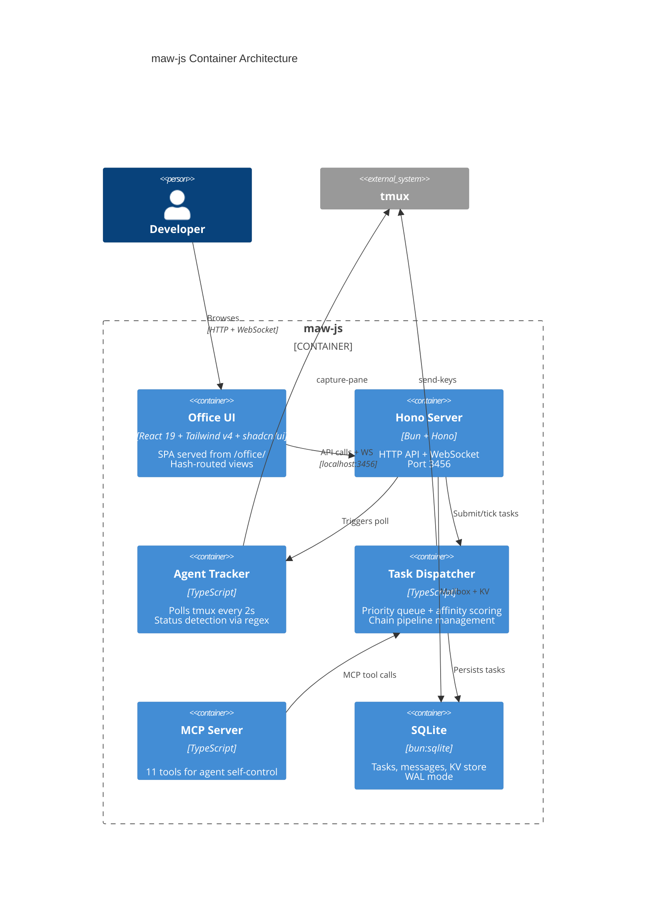
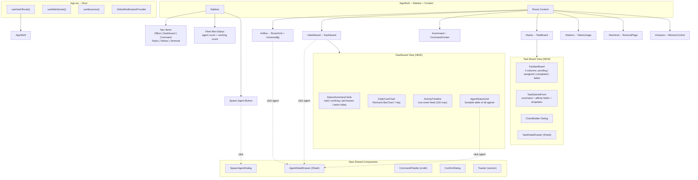
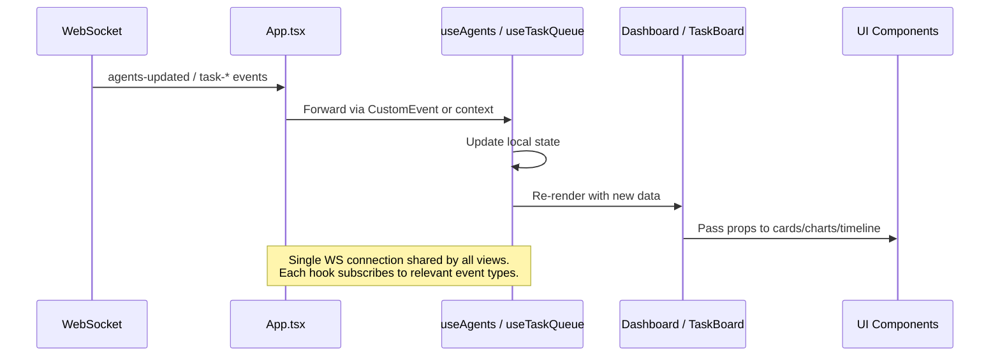
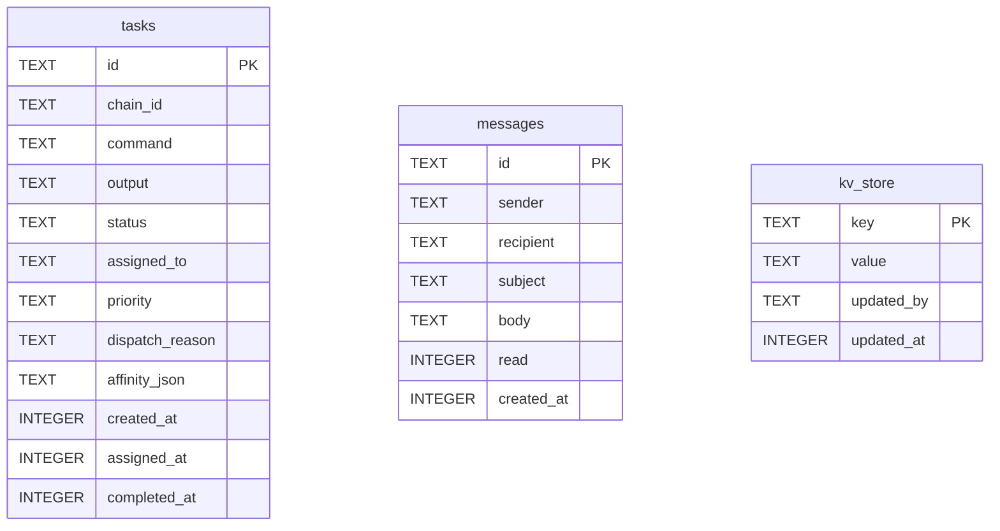
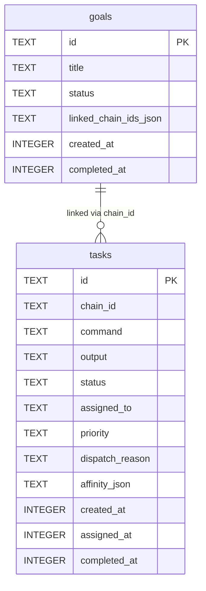

# maw-js Dashboard Enhancement -- Solution Architecture

**Version:** 1.0
**Date:** 2026-03-13
**Author:** Solution Architect Agent
**Status:** READY FOR IMPLEMENTATION
**Input:** `docs/phase1-maw-dashboard-requirements.md` (PRD v1.0, 17 user stories)

---

## Table of Contents

1. [Architecture Assessment](#1-architecture-assessment)
2. [C4 Diagrams](#2-c4-diagrams)
3. [Component Architecture](#3-component-architecture)
4. [Frontend Architecture Decisions](#4-frontend-architecture-decisions)
5. [API Contract Review](#5-api-contract-review)
6. [Database Schema Changes](#6-database-schema-changes)
7. [Component Library Strategy](#7-component-library-strategy)
8. [Tech Stack Decisions (ADRs)](#8-tech-stack-decisions-adrs)
9. [Migration Strategy](#9-migration-strategy)
10. [Security Assessment](#10-security-assessment)
11. [Performance Budget](#11-performance-budget)
12. [Sprint Implementation Guide](#12-sprint-implementation-guide)

---

## 1. Architecture Assessment

### 1.1 Current State

| Dimension | Current | Assessment |
|---|---|---|
| Backend | Hono HTTP + native Bun WebSocket, single process | SOLID -- no changes needed |
| Frontend | React 19 + Tailwind v4 + Vite 6 SPA | Good foundation, needs structural upgrade |
| Routing | Hash-based (`useHashRoute` in App.tsx) | Works but primitive -- keep for simplicity |
| State management | Local state + `useSessions` hook + custom events | Sufficient for current scope, needs extraction |
| Real-time | WebSocket with 50ms capture + 2s agent poll | SOLID -- no changes needed |
| Styling | Tailwind v4 + raw CSS in index.css | Needs design token layer |
| Component library | None -- hand-built components | Gap -- install shadcn/ui |
| Navigation | StatusBar with horizontal nav links | Replace with sidebar shell |
| Bundle size | ~6 runtime deps, Three.js is 300KB+ | Three.js is the elephant |

### 1.2 Risk Assessment

| Risk | Impact | Probability | Mitigation |
|---|---|---|---|
| shadcn/ui + Tailwind v4 compatibility | Med | Low | shadcn/ui v2.3+ supports Tailwind v4 natively via CSS variables |
| Three.js inflating bundle past 500KB target | High | High | Lazy-load UniverseBg only on `#office` route |
| Hash routing conflicts with new views | Low | Low | New views use same hash pattern -- no migration needed |
| WebSocket message volume with more UI consumers | Med | Low | All views share single WS connection via existing hook |
| Recharts bundle size (~45KB gzipped) | Med | Med | Acceptable trade-off vs hand-coded SVG charts |

### 1.3 Architecture Principles for This Enhancement

1. **No backend changes for Phases 1-3** -- all enhancements are frontend-only (exception: US-4.3 Goals)
2. **Incremental adoption** -- shadcn/ui components added alongside existing ones, no big-bang rewrite
3. **Single WebSocket** -- all views share the existing connection; no new polling mechanisms
4. **Dark-mode only** -- no theme toggle, all tokens hardcoded for dark
5. **Local-first** -- templates in localStorage, no new backend persistence until Goals (Phase 4)

---

## 2. C4 Diagrams

### 2.1 C4 Context Diagram



### 2.2 C4 Container Diagram



### 2.3 Frontend Component Architecture (After Enhancement)



---

## 3. Component Architecture -- File Structure

### 3.1 New Directory Layout

```
office/src/
  components/
    ui/                       # shadcn/ui primitives (auto-generated)
      button.tsx
      card.tsx
      dialog.tsx
      dropdown-menu.tsx
      input.tsx
      label.tsx
      select.tsx
      separator.tsx
      sheet.tsx
      badge.tsx
      tabs.tsx
      tooltip.tsx
      command.tsx              # cmdk-based (for Cmd+K palette)
      scroll-area.tsx
      textarea.tsx
      toggle.tsx
      progress.tsx
    layout/                   # App shell components
      AppShell.tsx             # Sidebar + main content area
      Sidebar.tsx              # Persistent left sidebar
      SidebarNav.tsx           # Navigation items
      SidebarFleetStatus.tsx   # Mini fleet status in sidebar
    dashboard/                # Dashboard view (Epic 2)
      DashboardView.tsx        # Route container
      StatusSummaryCards.tsx    # 4 KPI cards
      DailyCostChart.tsx       # Recharts 7-day bar chart
      ActivityTimeline.tsx     # Live event feed
      AgentStatusGrid.tsx      # Sortable agent table
    tasks/                    # Task Board view (Epic 3)
      TaskBoardView.tsx        # Route container
      KanbanBoard.tsx          # 4-column Kanban layout
      KanbanColumn.tsx         # Individual column
      TaskCard.tsx             # Card within column
      TaskDetailDrawer.tsx     # Sheet showing full task info
      TaskSubmitForm.tsx       # Enhanced form with affinity
      ChainBuilderDialog.tsx   # Multi-step chain composer
      TaskTemplatesPicker.tsx  # localStorage template picker
    agents/                   # Agent management components
      AgentDetailDrawer.tsx    # Sheet with full agent context
      SpawnAgentDialog.tsx     # Spawn form dialog
      DirectoryBrowser.tsx     # Directory picker sub-component
      AgentDefPicker.tsx       # Agent definition dropdown
      ConfirmKillDialog.tsx    # Kill confirmation dialog
      WorkerToggle.tsx         # Promote/demote toggle button
      RenameInline.tsx         # Inline rename input
    shared/                   # Cross-cutting components
      CommandPalette.tsx       # Cmd+K palette
      ConfirmDialog.tsx        # Generic confirmation dialog
      StatusBadge.tsx          # Reusable status badge (color + text)
      EmptyState.tsx           # Empty state placeholder
    # Existing components remain untouched:
    AgentCard.tsx
    AgentAvatar.tsx
    BottomStats.tsx
    CommandCenter.tsx
    GlobalNotificationProvider.tsx
    HoverPreviewCard.tsx
    Joystick.tsx
    KvStorePanel.tsx
    MailboxPanel.tsx
    MissionControl.tsx
    NotificationSettings.tsx
    OracleSearch.tsx
    RoomGrid.tsx
    RpcPanel.tsx
    SaiyanToasts.tsx
    ShortcutOverlay.tsx
    StatusBar.tsx              # Still used by old views, kept for compat
    TerminalModal.tsx
    TerminalPage.tsx
    TokenUsage.tsx
    UniverseBg.tsx
  hooks/
    useWebSocket.ts            # Existing -- no changes
    useSessions.ts             # Existing -- no changes
    useNotifications.ts        # Existing -- no changes
    useAgents.ts               # NEW: hook consuming WS agents-updated
    useTaskQueue.ts            # NEW: hook consuming WS queue events
    useActivityFeed.ts         # NEW: hook collecting WS events for timeline
    useTokenUsage.ts           # NEW: hook wrapping /api/token-usage fetch
    useCommandPalette.ts       # NEW: Cmd+K state + actions
  lib/
    types.ts                   # Existing -- add Goal types for Phase 4
    ansi.ts                    # Existing
    avatar.ts                  # Existing
    constants.ts               # Existing
    sounds.ts                  # Existing
    api.ts                     # NEW: typed fetch helpers for REST endpoints
    task-templates.ts          # NEW: localStorage template CRUD
    design-tokens.ts           # NEW: exported token constants (optional, CSS vars primary)
    cn.ts                      # NEW: shadcn utility (clsx + twMerge)
```

### 3.2 Key Data Flow



---

## 4. Frontend Architecture Decisions

### 4.1 shadcn/ui Integration with Tailwind v4

**Decision:** Install shadcn/ui using its Tailwind v4 CSS-variables mode.

**How it works:**
- shadcn/ui v2.3+ outputs CSS custom properties prefixed with `--` inside a `@theme` block
- Tailwind v4 reads these variables natively (no `tailwind.config.ts` needed)
- All shadcn components are copied into `office/src/components/ui/` (not installed as a package)

**Setup steps:**
1. Install peer deps: `bun add class-variance-authority clsx tailwind-merge`
2. Create `office/src/lib/cn.ts`:
   ```ts
   import { type ClassValue, clsx } from "clsx";
   import { twMerge } from "tailwind-merge";
   export function cn(...inputs: ClassValue[]) { return twMerge(clsx(inputs)); }
   ```
3. Add CSS variables to `office/src/index.css` (see Section 4.5)
4. Create `office/components.json` for shadcn CLI:
   ```json
   {
     "$schema": "https://ui.shadcn.com/schema.json",
     "style": "new-york",
     "tailwind": {
       "config": "",
       "css": "src/index.css",
       "baseColor": "zinc",
       "cssVariables": true
     },
     "rsc": false,
     "tsx": true,
     "aliases": {
       "components": "@/components",
       "utils": "@/lib/cn",
       "ui": "@/components/ui",
       "lib": "@/lib",
       "hooks": "@/hooks"
     }
   }
   ```
5. Add path alias to `vite.config.ts`:
   ```ts
   resolve: {
     alias: {
       "@shared": resolve(__dirname, "../src/types"),
       "@": resolve(__dirname, "./src"),
     },
   },
   ```
6. Update `tsconfig.json` paths:
   ```json
   "paths": {
     "@shared/*": ["../src/types/*"],
     "@/*": ["./src/*"]
   }
   ```
7. Use `bunx shadcn@latest add button card dialog sheet badge ...` to install components

### 4.2 Router Strategy: Keep Hash Routing

**Decision:** Keep hash routing. Do not migrate to path-based routing.

**Rationale:**
- The Hono server serves `/office` as a static SPA -- hash routes work without server-side catch-all
- 5 existing views use hash routes; changing them would break bookmarks and the StatusBar nav
- No SEO requirement (local tool)
- Adding a router library (react-router-dom) adds bundle size for zero benefit

**New routes added:**
- `#dashboard` -- Fleet Status Overview (US-2.1)
- `#tasks` -- Kanban Task Board (US-3.1)
- `#goals` -- Goal Hierarchy Panel (US-4.3, Phase 4 only)

**Updated `useHashRoute` to recognize:**
```ts
const VALID_ROUTES = ["office", "dashboard", "mission", "command", "tasks", "tokens", "terminal", "goals"] as const;
type Route = typeof VALID_ROUTES[number];
```

### 4.3 State Management Strategy

**Decision:** No new state library. Use a lightweight event-bus pattern with React hooks.

**Current approach (keep):**
- `useSessions()` -- polls captures, derives agent states, fires blink/saiyan effects
- `useWebSocket()` -- single WS connection, forwards messages via callback
- `window.dispatchEvent(new CustomEvent("maw-ws-message"))` -- event bus for CommandCenter

**New hooks (add):**

| Hook | Purpose | Data Source |
|---|---|---|
| `useAgents()` | Subscribe to `agents-updated` WS events, return `TrackedAgent[]` | WS via CustomEvent |
| `useTaskQueue()` | Subscribe to `task-*` and `queue-status` events, return categorized tasks | WS via CustomEvent |
| `useActivityFeed()` | Collect all WS events into a capped array (100 items) for timeline | WS via CustomEvent |
| `useTokenUsage()` | Fetch `/api/token-usage` with 30s auto-refresh | REST fetch |
| `useCommandPalette()` | Manage Cmd+K open state, search, actions | Local state |

**Why not React Query / Zustand / Context?**
- React Query adds 13KB gzipped for one REST endpoint (`/api/token-usage`). A simple `useEffect` + `useState` with a 30s `setInterval` achieves the same for 0KB.
- Zustand adds 2KB but no real win over the existing CustomEvent pattern that already works for CommandCenter.
- React Context would cause re-renders across unrelated views when agents update.
- The CustomEvent pattern is already proven in this codebase and decouples consumers from the WS provider.

**Implementation of `useAgents` hook:**
```ts
// office/src/hooks/useAgents.ts
import { useState, useEffect } from "react";
import type { TrackedAgent } from "@/lib/types";

export function useAgents(): TrackedAgent[] {
  const [agents, setAgents] = useState<TrackedAgent[]>([]);

  useEffect(() => {
    const handler = (e: Event) => {
      const data = (e as CustomEvent).detail;
      if (data.type === "agents-updated") {
        setAgents(data.agents);
      }
    };
    window.addEventListener("maw-ws-message", handler);
    return () => window.removeEventListener("maw-ws-message", handler);
  }, []);

  return agents;
}
```

### 4.4 WebSocket Data Flow for Real-Time Updates

The existing WebSocket broadcasts these event types relevant to the new UI:

| WS Event | Producer | Consumers (NEW) |
|---|---|---|
| `agents-updated` | 2s poll loop | Dashboard (grid, summary cards), Sidebar (fleet count), AgentDetailDrawer |
| `task-submitted` | dispatcher | TaskBoard (Kanban pending), ActivityTimeline |
| `task-assigned` | dispatcher | TaskBoard (Kanban assigned), ActivityTimeline, Dashboard (tasks today) |
| `task-completed` | dispatcher | TaskBoard (Kanban completed), ActivityTimeline, Dashboard (tasks today) |
| `task-failed` | dispatcher | TaskBoard (Kanban failed), ActivityTimeline |
| `task-timeout` | dispatcher | TaskBoard, ActivityTimeline |
| `chain-created` | dispatcher | ActivityTimeline, ChainBuilder confirm |
| `chain-completed` | dispatcher | ActivityTimeline |
| `chain-failed` | dispatcher | ActivityTimeline |
| `agent-spawned` | spawn API | ActivityTimeline, Sidebar (count update) |
| `agent-killed` | kill API | ActivityTimeline, Sidebar (count update) |
| `queue-status` | WS connect | TaskBoard initial state |

**No new WebSocket events needed.** The existing event set covers all new UI requirements.

### 4.5 Design Token System (CSS Variables)

Add to `office/src/index.css` after the `@import "tailwindcss"` line:

```css
@theme {
  /* ── Base palette ──────────────────────────────────────────── */
  --color-bg-base: #020208;
  --color-bg-surface: #0a0a14;
  --color-bg-elevated: #12121e;
  --color-bg-overlay: rgba(0, 0, 0, 0.7);

  --color-border-default: rgba(255, 255, 255, 0.06);
  --color-border-subtle: rgba(255, 255, 255, 0.03);
  --color-border-strong: rgba(255, 255, 255, 0.12);

  --color-text-primary: #e8e8f0;
  --color-text-secondary: rgba(255, 255, 255, 0.5);
  --color-text-muted: rgba(255, 255, 255, 0.35);
  --color-text-inverted: #020208;

  /* ── Status colors ─────────────────────────────────────────── */
  --color-status-working: #22d3ee;       /* cyan-400 */
  --color-status-waiting: #fbbf24;       /* amber-400 */
  --color-status-permission: #fb923c;    /* orange-400 */
  --color-status-error: #f87171;         /* red-400 */
  --color-status-idle: #6b7280;          /* gray-500 */
  --color-status-completed: #4ade80;     /* green-400 */

  /* ── Accent ────────────────────────────────────────────────── */
  --color-accent-primary: #22d3ee;       /* cyan-400 -- links, active nav */
  --color-accent-brand: #F4001A;         /* TigerSoft Red -- logo, brand marks */
  --color-accent-success: #4ade80;       /* green-400 */
  --color-accent-warning: #fbbf24;       /* amber-400 */
  --color-accent-danger: #f87171;        /* red-400 */

  /* ── Typography scale ──────────────────────────────────────── */
  --font-sans: 'Inter', 'SF Pro Display', system-ui, sans-serif;
  --font-mono: 'SF Mono', 'Fira Code', 'Courier New', monospace;

  --text-xs: 0.6875rem;    /* 11px */
  --text-sm: 0.8125rem;    /* 13px */
  --text-base: 0.875rem;   /* 14px */
  --text-lg: 1rem;         /* 16px */
  --text-xl: 1.25rem;      /* 20px */
  --text-2xl: 1.5rem;      /* 24px */

  /* ── Spacing / Radius ──────────────────────────────────────── */
  --radius-sm: 6px;
  --radius-md: 10px;
  --radius-lg: 16px;
  --radius-xl: 20px;

  /* ── shadcn/ui required variables (dark mode values) ────────── */
  --background: 240 15% 3%;
  --foreground: 240 10% 92%;
  --card: 240 15% 5%;
  --card-foreground: 240 10% 92%;
  --popover: 240 15% 5%;
  --popover-foreground: 240 10% 92%;
  --primary: 187 80% 54%;
  --primary-foreground: 240 15% 3%;
  --secondary: 240 10% 12%;
  --secondary-foreground: 240 10% 92%;
  --muted: 240 10% 12%;
  --muted-foreground: 240 5% 50%;
  --accent: 240 10% 16%;
  --accent-foreground: 240 10% 92%;
  --destructive: 0 84% 60%;
  --destructive-foreground: 240 10% 92%;
  --border: 240 5% 16%;
  --input: 240 5% 16%;
  --ring: 187 80% 54%;
  --radius: 0.625rem;
}
```

### 4.6 Sidebar Navigation Coexistence

**Strategy:** Wrap all views in a new `AppShell` component that provides the sidebar. Existing views render inside the content area.

```tsx
// office/src/components/layout/AppShell.tsx
export function AppShell({ children, route, agents, connected }: AppShellProps) {
  return (
    <div className="flex h-dvh" style={{ background: "var(--color-bg-base)" }}>
      <Sidebar route={route} agents={agents} connected={connected} />
      <main className="flex-1 overflow-y-auto">
        {children}
      </main>
    </div>
  );
}
```

**Sidebar width:** 220px on desktop (fixed), collapsible to 56px (icon-only) via toggle.

**Views wrapped in AppShell:** All views (office, dashboard, command, tasks, tokens, terminal, mission).

**StatusBar removal:** The `StatusBar` component is **NOT removed** -- it is simply no longer rendered when the sidebar is active. Views that previously had `<StatusBar>` will have it replaced by `<AppShell>`. This preserves backward compatibility if someone accesses the old hash routes directly.

---

## 5. API Contract Review

### 5.1 Existing API Endpoints (from server.ts)

| Method | Path | Auth | Description |
|---|---|---|---|
| GET | `/api/sessions` | None | List all tmux sessions and windows |
| GET | `/api/capture` | None | Capture terminal content (`?target=&lines=`) |
| POST | `/api/send` | None | Send keystrokes to a tmux target |
| POST | `/api/select` | None | Select/focus a tmux window |
| GET | `/api/agents` | None | Get all tracked agents (TrackedAgent[]) |
| POST | `/api/agents/worker` | None | Add/remove worker status |
| POST | `/api/agents/spawn` | PathVal | Spawn a new agent session |
| DELETE | `/api/agents/:target` | None | Kill a specific agent window |
| PATCH | `/api/agents/:target/name` | None | Rename a tmux window |
| DELETE | `/api/sessions/:name` | None | Kill an entire tmux session |
| GET | `/api/agent-definitions` | None | List agent definition files from ~/.maw/agents/ |
| GET | `/api/queue` | None | Get queue status (pending, assigned, history) |
| POST | `/api/queue/submit` | None | Submit a new task |
| POST | `/api/queue/cancel` | None | Cancel a pending task |
| GET | `/api/chain` | None | Get all task chains |
| POST | `/api/chain/submit` | None | Submit a new task chain |
| DELETE | `/api/chain/:id` | None | Cancel a running chain |
| GET | `/api/browse` | PathVal | Browse directories |
| POST | `/api/open-file` | PathVal | Open a file in default app |
| POST | `/api/upload` | None | Upload a file |
| GET | `/api/token-usage` | None | Get aggregated token usage |
| GET | `/api/token-usage/realtime` | None | Get realtime session token info |
| GET | `/api/usage-limits` | None | Get 5h/weekly usage limits |
| GET | `/api/oracle/search` | None | Proxy to Oracle search |
| GET | `/api/oracle/traces` | None | Proxy to Oracle traces |
| GET | `/api/oracle/stats` | None | Proxy to Oracle stats |
| Various | `/api/mailbox/*` | None | Agent-to-agent messaging |
| Various | `/api/kv/*` | None | Shared KV store |
| Various | `/api/rpc/*` | None | Agent-to-agent RPC |
| Various | `/api/discovery/*` | None | Agent discovery |

**WebSocket:** `ws://localhost:3456/ws` -- bidirectional (see types in `src/types/ws.ts`)

### 5.2 New Endpoints Required

Only **one new feature** requires backend changes: **US-4.3 Goal Hierarchy** (Phase 4, Sprint 5).

#### Goals API (Phase 4 only)

```
GET /api/goals
  Description: List all goals
  Response 200:
    Goal[]

  TypeScript:
    interface Goal {
      id: string;
      title: string;
      status: "in_progress" | "completed";
      linkedChainIds: string[];
      createdAt: number;
      completedAt?: number;
    }

  Go structs: N/A (Bun/TypeScript backend)

  Mock response:
    [
      {
        "id": "a1b2c3d4",
        "title": "Complete Auth Module v2",
        "status": "in_progress",
        "linkedChainIds": ["e5f6g7h8", "i9j0k1l2"],
        "createdAt": 1710288000000,
        "completedAt": null
      }
    ]

---

POST /api/goals
  Description: Create a new goal
  Request:
    { "title": "string (required, min 1 char, max 200 chars)" }
  Response 200:
    { "ok": true, "goal": Goal }
  Errors:
    400 { "error": "title required" }
    500 { "error": "string" }

  Mock response:
    {
      "ok": true,
      "goal": {
        "id": "m3n4o5p6",
        "title": "Implement Recruitment Pipeline",
        "status": "in_progress",
        "linkedChainIds": [],
        "createdAt": 1710374400000
      }
    }

---

PATCH /api/goals/:id
  Description: Update goal (title, status, link/unlink chains)
  Request:
    {
      "title?": "string",
      "status?": "in_progress | completed",
      "linkChainId?": "string (chain ID to link)",
      "unlinkChainId?": "string (chain ID to unlink)"
    }
  Response 200:
    { "ok": true, "goal": Goal }
  Errors:
    404 { "error": "goal not found" }
    500 { "error": "string" }

---

DELETE /api/goals/:id
  Description: Delete a goal
  Response 200:
    { "ok": true }
  Errors:
    404 { "error": "goal not found" }
```

### 5.3 Existing Endpoints Used by New UI

| New UI Feature | Endpoints Used | Notes |
|---|---|---|
| Dashboard StatusSummaryCards | WS `agents-updated` + WS `task-*` | No REST call needed -- all WS |
| Dashboard CostChart | `GET /api/token-usage` | 30s cache on server, 30s client refresh |
| Dashboard ActivityTimeline | WS events (all types) | No REST -- pure WS stream |
| Dashboard AgentStatusGrid | WS `agents-updated` | Same as Office view |
| Sidebar FleetStatus | WS `agents-updated` | Count agents/working from WS |
| AgentDetailDrawer | WS `agents-updated` (per-agent filter) | Agent context comes with the event |
| Worker Toggle | `POST /api/agents/worker` or WS `toggle-worker` | Both paths work |
| Agent Rename | `PATCH /api/agents/:target/name` | Existing |
| Kill Agent | `DELETE /api/agents/:target` | Existing |
| Kill Session | `DELETE /api/sessions/:name` | Existing |
| SpawnAgentDialog | `GET /api/agent-definitions` + `GET /api/browse` + `POST /api/agents/spawn` | All existing |
| TaskBoard Kanban | WS `queue-status` (initial) + WS `task-*` (updates) | All existing |
| TaskDetailDrawer | In-memory from Kanban state | No new endpoint |
| TaskSubmitForm | `POST /api/queue/submit` or WS `submit-task` | Existing |
| ChainBuilder | `POST /api/chain/submit` or WS `submit-chain` | Existing |
| TaskTemplates | localStorage only | No backend |
| CommandPalette | Local state -- actions map to existing APIs | No backend |
| Open File (from AgentDetailDrawer) | `POST /api/open-file` | Existing |

**Conclusion: Zero new backend endpoints for Phases 1-3. Phase 4 adds 4 endpoints (Goals CRUD).**

### 5.4 Error Contract (Shared)

All API errors follow this shape (already in use across the codebase):

```ts
// Success
{ ok: true, ...payload }

// Error (400/404/500)
{ error: "human-readable message" }
```

For Zod validation errors (spawn, submit, etc):
```ts
// 400
{ error: "field-specific validation message from Zod" }
```

---

## 6. Database Schema Changes

### 6.1 Current Schema (from store.ts)



### 6.2 New Table: Goals (Phase 4 only)



**SQL migration (add to `initDb()` in Phase 4):**

```sql
CREATE TABLE IF NOT EXISTS goals (
  id                    TEXT    PRIMARY KEY,
  title                 TEXT    NOT NULL,
  status                TEXT    NOT NULL DEFAULT 'in_progress',
  linked_chain_ids_json TEXT    DEFAULT '[]',
  created_at            INTEGER NOT NULL,
  completed_at          INTEGER
);
```

**No changes to existing tables for Phases 1-3.**

---

## 7. Component Library Strategy

### 7.1 shadcn/ui Components to Install

| Component | Used By | Sprint |
|---|---|---|
| `button` | All new forms, dialogs, actions | 1 |
| `card` | Dashboard summary cards, Kanban task cards | 1 |
| `dialog` | SpawnAgentDialog, ConfirmKillDialog, ChainBuilder | 1 |
| `sheet` | AgentDetailDrawer, TaskDetailDrawer | 1 |
| `badge` | Status badges, priority badges, affinity tags | 1 |
| `input` | All form inputs | 1 |
| `label` | Form labels | 1 |
| `select` | Priority picker, agent picker | 1 |
| `separator` | Sidebar section separators | 1 |
| `tooltip` | Action button tooltips | 1 |
| `scroll-area` | Kanban columns, timeline, drawer content | 2 |
| `textarea` | Task command input, chain step prompts | 2 |
| `tabs` | Agent detail drawer sections | 2 |
| `dropdown-menu` | Agent card context menu, task card actions | 2 |
| `toggle` | Worker toggle | 1 |
| `progress` | Goal progress bar (Phase 4) | 5 |
| `command` | Command palette (cmdk) | 4 |

**Install command (Sprint 1):**
```bash
cd office
bunx shadcn@latest add button card dialog sheet badge input label select separator tooltip toggle scroll-area textarea tabs dropdown-menu
```

### 7.2 Dark Theme Wrapping

shadcn/ui components already support CSS variable theming. The variables defined in Section 4.5 override the default light theme. No wrapper components needed -- the primitives render dark by default.

**One requirement:** The `<html>` element must have `class="dark"` (already implicit since there is no light mode). Add to `office/index.html`:
```html
<html lang="en" class="dark">
```

### 7.3 Custom Status Badge Component

shadcn/ui `Badge` does not have status-color semantics. Create a wrapper:

```tsx
// office/src/components/shared/StatusBadge.tsx
import { Badge } from "@/components/ui/badge";
import { cn } from "@/lib/cn";
import type { AgentStatus } from "@/lib/types";

const STATUS_CONFIG: Record<AgentStatus, { label: string; className: string; icon: string }> = {
  working:    { label: "Working",    className: "bg-cyan-500/15 text-cyan-400 border-cyan-500/20",       icon: "spinner" },
  waiting:    { label: "Waiting",    className: "bg-amber-500/15 text-amber-400 border-amber-500/20",   icon: "clock" },
  permission: { label: "Permission", className: "bg-orange-500/15 text-orange-400 border-orange-500/20", icon: "alert" },
  error:      { label: "Error",      className: "bg-red-500/15 text-red-400 border-red-500/20",         icon: "x" },
  idle:       { label: "Idle",       className: "bg-gray-500/15 text-gray-400 border-gray-500/20",       icon: "minus" },
};

export function StatusBadge({ status }: { status: AgentStatus }) {
  const config = STATUS_CONFIG[status];
  return (
    <Badge variant="outline" className={cn("gap-1.5 text-xs font-medium", config.className)}>
      <span className="w-1.5 h-1.5 rounded-full bg-current" />
      {config.label}
    </Badge>
  );
}
```

---

## 8. Tech Stack Decisions (ADRs)

### ADR-001: Chart Library Selection

**Context:** US-2.2 requires a 7-day bar/line chart for token cost. Options: Recharts, hand-coded SVG, visx, Chart.js.

**Decision:** **Recharts**

| Option | Bundle (gzipped) | React 19 compat | Dark mode | Rationale |
|---|---|---|---|---|
| **Recharts** | ~45KB | Yes (tested) | CSS themeable | Well-maintained, declarative, responsive, SSR-safe |
| Hand-coded SVG | 0KB | N/A | Full control | High effort for a simple chart; no tooltip/animation support |
| visx | ~35KB | Yes | CSS themeable | Lower-level than Recharts; more work for same result |
| Chart.js | ~65KB | Yes (via react-chartjs-2) | Plugin-based | Heavier, canvas-based (not SVG), harder to theme |

**Consequences:**
- +45KB bundle. Acceptable -- stays within 500KB budget even with shadcn/ui.
- Install: `bun add recharts`
- Usage: `<BarChart>` with `<Bar>` and custom dark theme CSS fills.

### ADR-002: Drag-and-Drop Library for Kanban

**Context:** US-3.1 Kanban board. PRD explicitly states "no drag-and-drop required for MVP" -- click-only is acceptable. US-3.4 Chain Builder needs step reordering.

**Decision:** **No drag-and-drop library for MVP. Use click-based actions for Kanban. Add dnd-kit in Sprint 4 for chain step reordering only if needed.**

**Rationale:**
- Kanban tasks move between columns via backend events, not user drag. Users click "Cancel" on pending, not drag to failed.
- Chain step reordering (US-3.4) is the only genuine drag case. Simple up/down buttons are sufficient for 3-5 steps.
- dnd-kit adds ~15KB. Defer until a real user need emerges.
- pragmatic-drag-and-drop is lighter but less ecosystem support.

**Consequences:**
- Kanban columns render from filtered task arrays (pending/assigned/completed/failed).
- No drag handles, no drop zones, no drag overlay.
- If drag is added later, dnd-kit is the recommended choice (tree-shakeable, accessible, React 19 compatible).

### ADR-003: Command Palette Library

**Context:** US-4.1 requires a Cmd+K command palette. Options: cmdk, kbar, custom.

**Decision:** **cmdk** (shadcn/ui has a built-in `Command` component based on cmdk)

| Option | Bundle (gzipped) | Integration | Rationale |
|---|---|---|---|
| **cmdk (via shadcn)** | ~4KB (included in shadcn command) | Native | shadcn/ui ships `command.tsx` built on cmdk. Zero extra deps. |
| kbar | ~8KB | Standalone | More features but separate styling system. |
| Custom | 0KB | Full control | Not worth the effort for fuzzy search + keyboard nav. |

**Consequences:**
- Install via `bunx shadcn@latest add command` (Sprint 4)
- Wraps `cmdk` with shadcn styling -- dark mode automatic.
- Actions: navigate to views, target agents, submit tasks.

### ADR-004: Toast/Notification Library

**Context:** Multiple stories require success/error toasts (US-1.3, US-1.5, US-1.6, etc.).

**Decision:** **sonner** (shadcn/ui recommended toast library)

**Rationale:** 3KB gzipped, dark mode support, works with React 19, shadcn `<Toaster>` wraps it.

**Install:** `bun add sonner` then `bunx shadcn@latest add sonner`

---

## 9. Migration Strategy

### 9.1 Incremental View Addition

**Principle:** New views are additive. Existing views are untouched until Phase 1 is complete and stable.

**Step 1 (Sprint 1):** Add `AppShell` wrapper. Existing views render inside the content area. `StatusBar` is still present inside each view but becomes redundant -- remove it per view as each is verified working inside the shell.

**Step 2:** The `#dashboard` and `#tasks` routes are completely new -- no migration, just new branches in the `useHashRoute` switch.

**Step 3:** Existing views (`#office`, `#mission`, `#command`, `#tokens`, `#terminal`) continue to work unchanged inside the shell.

### 9.2 Backward Compatibility Plan

| Concern | Mitigation |
|---|---|
| Existing `#office` hash route | Still works. `AppShell` wraps the `RoomGrid` + `UniverseBg` view. |
| Existing `#command` hash route | Still works. CommandCenter renders inside shell content area. |
| StatusBar used by existing views | Keep `StatusBar.tsx` in codebase. Remove from render tree view-by-view as sidebar takes over. |
| CLI commands (`maw hey`, `maw peek`) | Zero impact -- CLI uses REST/WS API, not the UI. |
| `CustomEvent("maw-ws-message")` bus | Keep working. New hooks also listen to the same event. |
| Three.js `UniverseBg` on office view | Lazy-load only when `route === "office"`. Not imported by other views. |

### 9.3 File-Level Migration Plan

```
Sprint 1:
  ADD:  office/src/components/ui/*.tsx          (shadcn primitives)
  ADD:  office/src/components/layout/AppShell.tsx
  ADD:  office/src/components/layout/Sidebar.tsx
  ADD:  office/src/components/layout/SidebarNav.tsx
  ADD:  office/src/components/agents/WorkerToggle.tsx
  ADD:  office/src/components/agents/RenameInline.tsx
  ADD:  office/src/components/agents/ConfirmKillDialog.tsx
  ADD:  office/src/components/shared/StatusBadge.tsx
  ADD:  office/src/lib/cn.ts
  EDIT: office/src/index.css                    (add design tokens)
  EDIT: office/src/App.tsx                      (wrap in AppShell)
  EDIT: office/vite.config.ts                   (add @ alias)
  KEEP: All existing components unchanged

Sprint 2:
  ADD:  office/src/components/agents/SpawnAgentDialog.tsx
  ADD:  office/src/components/agents/DirectoryBrowser.tsx
  ADD:  office/src/components/agents/AgentDefPicker.tsx
  ADD:  office/src/components/dashboard/DashboardView.tsx
  ADD:  office/src/components/dashboard/StatusSummaryCards.tsx
  ADD:  office/src/components/dashboard/DailyCostChart.tsx
  ADD:  office/src/components/dashboard/ActivityTimeline.tsx
  ADD:  office/src/components/dashboard/AgentStatusGrid.tsx
  ADD:  office/src/hooks/useAgents.ts
  ADD:  office/src/hooks/useActivityFeed.ts
  ADD:  office/src/hooks/useTokenUsage.ts
  EDIT: office/src/App.tsx                      (add #dashboard route)

Sprint 3:
  ADD:  office/src/components/agents/AgentDetailDrawer.tsx
  ADD:  office/src/components/tasks/TaskBoardView.tsx
  ADD:  office/src/components/tasks/KanbanBoard.tsx
  ADD:  office/src/components/tasks/KanbanColumn.tsx
  ADD:  office/src/components/tasks/TaskCard.tsx
  ADD:  office/src/components/tasks/TaskDetailDrawer.tsx
  ADD:  office/src/components/tasks/TaskSubmitForm.tsx
  ADD:  office/src/hooks/useTaskQueue.ts
  EDIT: office/src/App.tsx                      (add #tasks route)

Sprint 4:
  ADD:  office/src/components/tasks/ChainBuilderDialog.tsx
  ADD:  office/src/components/tasks/TaskTemplatesPicker.tsx
  ADD:  office/src/components/shared/CommandPalette.tsx
  ADD:  office/src/hooks/useCommandPalette.ts
  ADD:  office/src/lib/task-templates.ts

Sprint 5:
  ADD:  office/src/components/goals/GoalsPanel.tsx
  ADD:  office/src/lib/api.ts                   (typed REST helpers for Goals API)
  EDIT: office/src/lib/types.ts                 (add Goal type)
  EDIT: office/src/App.tsx                      (add #goals route)
  EDIT: src/server.ts                           (add /api/goals/* routes)
  EDIT: src/db/store.ts                         (add goals table + CRUD)
```

---

## 10. Security Assessment

### 10.1 Threat Model

This is a **localhost-only developer tool**. The threat surface is minimal:

| Threat | Severity | Mitigation |
|---|---|---|
| Shell injection via spawn form session name | Medium | Backend `SpawnAgentSchema` (Zod) validates: `^[a-zA-Z0-9_-]+$`. Frontend adds client-side regex validation before submit. |
| Path traversal via directory browser | Medium | Backend `pathValidator` middleware restricts to `ALLOWED_ROOTS`. No frontend bypass possible. |
| Path traversal via open-file API | Medium | Backend `pathValidator` already applied. |
| XSS via terminal output rendering | Low | `ansiToHtml()` in `lib/ansi.ts` escapes HTML entities before inserting ANSI color spans. Review: confirmed safe. |
| localStorage template injection | Very Low | Templates stored in localStorage. Only the local user can write. Templates are used as command text sent to `POST /api/queue/submit` which is Zod-validated. |
| CORS misconfiguration | Low | CORS is `*` on `/api/*` -- acceptable for localhost. No secrets are returned. |
| WebSocket hijacking | Very Low | Localhost only. No auth needed. |

### 10.2 Recommendations

1. **SpawnAgentDialog** must validate session name client-side: `/^[a-zA-Z0-9][a-zA-Z0-9_-]{0,62}$/`
2. **RenameInline** must validate window name client-side: non-empty, max 64 chars, no shell metacharacters
3. **TaskSubmitForm** should sanitize command text display (already handled by ansiToHtml for output)
4. **No new file-access endpoints** added without `pathValidator` middleware
5. **Goals API** (Phase 4): validate title length server-side (max 200 chars) via Zod

---

## 11. Performance Budget

### 11.1 Bundle Size Budget

| Module | Current (est.) | Added | Budget |
|---|---|---|---|
| React + ReactDOM | ~45KB | 0 | 45KB |
| Three.js | ~150KB | 0 (lazy load) | 0KB (deferred) |
| Hono client (none) | 0 | 0 | 0 |
| Tailwind CSS (compiled) | ~15KB | +5KB (new tokens) | 20KB |
| shadcn/ui (tree-shaken) | 0 | ~20KB | 20KB |
| class-variance-authority | 0 | ~3KB | 3KB |
| clsx + tailwind-merge | 0 | ~4KB | 4KB |
| Recharts | 0 | ~45KB | 45KB |
| sonner (toasts) | 0 | ~3KB | 3KB |
| cmdk (via shadcn command) | 0 | ~4KB | 4KB |
| Application code | ~40KB | ~30KB | 70KB |
| **TOTAL (excl. Three.js)** | **~100KB** | **~114KB** | **~214KB** |
| **TOTAL (incl. Three.js)** | **~250KB** | **~114KB** | **~364KB** |

**Verdict:** Well within the 500KB gzipped budget. Three.js must be lazy-loaded via `React.lazy()` to keep the initial load for non-office routes under 220KB.

### 11.2 Lazy Loading Strategy

```tsx
// office/src/App.tsx
const UniverseBg = lazy(() => import("./components/UniverseBg"));
const MissionControl = lazy(() => import("./components/MissionControl"));
const DailyCostChart = lazy(() => import("./components/dashboard/DailyCostChart"));
```

- `UniverseBg` uses Three.js -- lazy-load on `#office` only
- `MissionControl` is complex -- lazy-load on `#mission` only
- `DailyCostChart` imports Recharts -- lazy-load on `#dashboard` only

### 11.3 Rendering Performance Targets

| Metric | Target | Measurement |
|---|---|---|
| Dashboard initial render | < 100ms | React DevTools Profiler |
| Agent grid update (WS event -> DOM) | < 200ms | Performance.mark() around setState |
| Kanban column re-render on task move | < 50ms | React DevTools Profiler |
| Cost chart render (7 data points) | < 100ms | Recharts render time |
| Command palette open -> interactive | < 100ms | Keyboard event -> first paint |
| Route switch (hash change) | < 50ms | No network request needed |

### 11.4 Memory Budget

| Concern | Budget | Rationale |
|---|---|---|
| ActivityTimeline events | Max 100 in memory | PRD AC: "capped to 100" |
| Task history | Max 50 (server-side cap in dispatcher) | Already enforced |
| Terminal capture cache | Per-WS-client, last content only | Already implemented |
| Agent state | Max ~50 agents realistic | In-memory Map, negligible |

---

## 12. Sprint Implementation Guide

### Sprint 1 -- Foundation Core (18 pts)

**Goal:** Install shadcn/ui, define design tokens, add sidebar shell, wire agent management actions.

**Implementation order:**

1. **US-1.2 shadcn/ui Integration (3 pts)**
   - Add peer deps: `bun add class-variance-authority clsx tailwind-merge`
   - Create `office/components.json`, `office/src/lib/cn.ts`
   - Add `@` alias to vite.config.ts and tsconfig.json
   - Install base components: button, card, dialog, sheet, badge, input, label, select, separator, tooltip, toggle
   - Verify: render a Button on a test page, confirm dark mode

2. **US-1.7 Design Tokens (3 pts)**
   - Add CSS variables to `office/src/index.css` (Section 4.5)
   - Add `class="dark"` to `office/index.html`
   - Audit existing hardcoded colors (#020208, status colors) and alias to new tokens
   - Verify: all 5 views render with consistent backgrounds

3. **US-1.1 Sidebar Navigation Shell (5 pts)**
   - Create `AppShell.tsx`, `Sidebar.tsx`, `SidebarNav.tsx`, `SidebarFleetStatus.tsx`
   - Wrap all routes in `App.tsx` with `AppShell`
   - Sidebar shows: nav links (Office, Dashboard, Command, Tasks, Tokens, Terminal), fleet count, Spawn button
   - Remove `StatusBar` from render tree (keep file for safety)
   - Verify: all hash routes accessible via sidebar, keyboard focus works

4. **US-1.3 Worker Promote/Demote (3 pts)**
   - Create `WorkerToggle.tsx` -- uses shadcn `Toggle` component
   - Wire to `POST /api/agents/worker` or WS `toggle-worker`
   - Add to `AgentCard.tsx` (or the equivalent card in the sidebar/office grid)
   - Verify: toggle persists across reload

5. **US-1.4 Agent Rename (2 pts)**
   - Create `RenameInline.tsx` -- click to edit, Enter to save, Escape to cancel
   - Wire to `PATCH /api/agents/:target/name`
   - Validate: non-empty, max 64 chars
   - Verify: rename updates agent card headline

6. **US-1.5 Kill Agent/Session (2 pts)**
   - Create `ConfirmKillDialog.tsx` using shadcn `Dialog`
   - "Kill Window" -> `DELETE /api/agents/:target`
   - "Kill Session" -> `DELETE /api/sessions/:name`
   - Verify: confirmation dialog, card disappears after kill

### Sprint 2 -- Spawner + Dashboard (20 pts)

**Goal:** Complete agent spawner, build the Dashboard view.

1. **US-1.6 Agent Spawner Form (5 pts)**
   - Create `SpawnAgentDialog.tsx` using shadcn `Dialog`
   - `DirectoryBrowser.tsx`: calls `GET /api/browse`, navigable tree
   - `AgentDefPicker.tsx`: calls `GET /api/agent-definitions`, shows name + description
   - Session name validation: `/^[a-zA-Z0-9][a-zA-Z0-9_-]{0,62}$/`
   - Optional initial prompt textarea
   - Submit: `POST /api/agents/spawn`
   - Verify: new agent appears in grid within 10s

2. **US-2.1 Fleet Status Dashboard (5 pts)**
   - Create `DashboardView.tsx` -- new `#dashboard` route
   - `StatusSummaryCards.tsx`: 4 cards (total agents, working, permission, tasks completed today)
   - `AgentStatusGrid.tsx`: table showing name, status badge, headline, project
   - Data from `useAgents()` hook
   - Click agent row -> open TerminalModal
   - Verify: counts update within 3s of agent state change

3. **US-2.2 Daily Cost Chart (5 pts)**
   - Install Recharts: `bun add recharts`
   - Create `DailyCostChart.tsx` -- lazy-loaded
   - `useTokenUsage()` hook: fetches `/api/token-usage` every 30s
   - Chart: BarChart with 7 days, today's bar highlighted differently
   - Missing days show zero bar
   - Verify: chart renders in < 100ms

4. **US-2.3 Activity Timeline (5 pts)**
   - Create `ActivityTimeline.tsx`
   - `useActivityFeed()` hook: listens to WS events, caps at 100
   - Each entry: timestamp, event type badge (color-coded), description
   - Event types: task-submitted (neutral), task-assigned (neutral), task-completed (green), task-failed (red), agent-spawned (neutral), agent-killed (neutral), chain-* events
   - Verify: events appear at top, capped at 100

### Sprint 3 -- Agent Detail + Task Board (19 pts)

1. **US-2.4 Agent Detail Drawer (3 pts)**
   - Create `AgentDetailDrawer.tsx` using shadcn `Sheet`
   - Shows: session/window name, status badge, workingDir, detectedStack, recentFiles (last 10), projectName, lastActiveAt, currentTaskId
   - Recent files clickable -> `POST /api/open-file`
   - Updates in real-time from WS
   - Verify: drawer updates without close/reopen

2. **US-3.1 Kanban Task Board (8 pts)**
   - Create `TaskBoardView.tsx` -> `#tasks` route
   - `KanbanBoard.tsx`: 4 columns (Pending, Assigned, Completed, Failed)
   - `KanbanColumn.tsx`: scrollable column, shows count
   - `TaskCard.tsx`: task ID, truncated command (80 chars), priority badge, age, assigned agent
   - `useTaskQueue()` hook: subscribes to WS `queue-status` + `task-*` events
   - Cancel button on pending tasks
   - Columns scroll independently
   - No drag-and-drop (per ADR-002)
   - Verify: task cards move between columns in real-time

3. **US-3.2 Task Detail Drawer (3 pts)**
   - Create `TaskDetailDrawer.tsx` using shadcn `Sheet`
   - Shows: full command, status, priority, timestamps, assigned agent, dispatch reason, affinity, output (monospace scrollable)
   - Pending tasks: "No output yet -- task is pending"
   - Verify: drawer shows all task metadata

4. **US-3.3 Enhanced Task Submission Form (5 pts)**
   - Create `TaskSubmitForm.tsx`
   - Fields: command (textarea), priority (select: High/Normal/Low), tags (multi-select or chip input), project name (text), preferred agent (select from live agents)
   - Auto-detect affinity from command text (show as chips)
   - Submit via `POST /api/queue/submit` or WS `submit-task`
   - Verify: submitted task appears in Pending column

### Sprint 4 -- Task Chains + Templates + Cmd+K (18 pts)

1. **US-3.4 Task Chain Builder (5 pts)**
   - Create `ChainBuilderDialog.tsx` using shadcn `Dialog`
   - Chain name input, dynamic step list (add/remove/reorder with up/down buttons)
   - Each step: prompt textarea
   - Minimum 1 step validation
   - Submit: `POST /api/chain/submit` or WS `submit-chain`
   - Cancel chain: `DELETE /api/chain/:id` or WS `cancel-chain`
   - Verify: chain appears in active chains, steps execute sequentially

2. **US-3.5 Task Templates (5 pts)**
   - Create `TaskTemplatesPicker.tsx` + `lib/task-templates.ts`
   - `task-templates.ts`: CRUD for localStorage key `maw-task-templates`
   - Template shape: `{ id, name, command, affinity? }`
   - "Save as Template" button in TaskSubmitForm
   - Template picker dropdown in TaskSubmitForm
   - Delete template with confirmation
   - Verify: templates persist across reload

3. **US-4.1 Command Palette (8 pts)**
   - Install: `bunx shadcn@latest add command`
   - Create `CommandPalette.tsx` wrapping shadcn `Command`
   - Cmd+K / Ctrl+K opens palette
   - Escape closes
   - Actions:
     - Navigate to views (fuzzy match: "dash" -> Dashboard)
     - Target agents (type agent name -> "Open Terminal", "Kill Agent", "Toggle Worker")
     - Quick task submit (type "task:" prefix -> submit as task)
   - `useCommandPalette.ts`: state management, action registry
   - Verify: all scenarios from PRD AC

### Sprint 5 -- Mobile + Goals (13-21 pts)

1. **US-4.2 Mobile Responsive Dashboard (5 pts)**
   - CSS-only: media queries for 375px width
   - Sidebar -> hamburger menu on mobile
   - Summary cards -> full-width stack
   - Agent grid -> single column
   - 44x44px touch targets
   - Verify: no horizontal scroll at 375px

2. **US-4.3 Goal Hierarchy Panel (8 pts)**
   - **Backend changes:**
     - Add `goals` table to `initDb()` in `src/db/store.ts`
     - Add goal CRUD functions to `src/db/store.ts`
     - Add 4 routes to `src/server.ts`: GET/POST/PATCH/DELETE `/api/goals/*`
   - **Frontend:**
     - Create `GoalsPanel.tsx` -> `#goals` route
     - Create goal form (title input)
     - Goals list with progress bars (chains complete / total)
     - Link chain to goal (context menu on chain)
     - "Mark Complete" button
     - `lib/api.ts`: typed fetch helpers for goals API
   - Verify: goal persists in SQLite, chain linkage calculates progress

---

## Appendix A: TypeScript Types for New Hooks

```ts
// office/src/hooks/useAgents.ts
export function useAgents(): TrackedAgent[];

// office/src/hooks/useTaskQueue.ts
export interface TaskQueueState {
  pending: Task[];
  assigned: Task[];
  completed: Task[];
  failed: Task[];
}
export function useTaskQueue(): TaskQueueState;

// office/src/hooks/useActivityFeed.ts
export interface ActivityEvent {
  id: string;
  timestamp: number;
  type: string;        // WS message type
  description: string; // Human-readable
  color: string;       // Accent color for event type
}
export function useActivityFeed(): ActivityEvent[];

// office/src/hooks/useTokenUsage.ts
export function useTokenUsage(): {
  data: TokenUsageResponse | null;
  loading: boolean;
  error: string | null;
};

// office/src/hooks/useCommandPalette.ts
export interface CommandAction {
  id: string;
  label: string;
  shortcut?: string;
  icon?: string;
  action: () => void;
}
export function useCommandPalette(): {
  open: boolean;
  setOpen: (v: boolean) => void;
  actions: CommandAction[];
};
```

## Appendix B: localStorage Schema

```ts
// Key: "maw-task-templates"
// Value: JSON string of TaskTemplate[]
interface TaskTemplate {
  id: string;           // crypto.randomUUID()
  name: string;         // User-given name
  command: string;      // Command text
  affinity?: {
    tags?: string[];
    projectName?: string;
    preferAgent?: string;
  };
  createdAt: number;    // Date.now()
}
```

## Appendix C: New Dependencies Summary

| Package | Version | Purpose | Size (gzipped) | Sprint |
|---|---|---|---|---|
| `class-variance-authority` | ^0.7 | shadcn/ui variant utility | ~3KB | 1 |
| `clsx` | ^2.1 | Conditional class names | ~1KB | 1 |
| `tailwind-merge` | ^2.6 | Tailwind class dedup | ~3KB | 1 |
| `recharts` | ^2.15 | Charts (cost chart) | ~45KB | 2 |
| `sonner` | ^2.0 | Toast notifications | ~3KB | 1 |

**Note:** shadcn/ui components are **not** npm packages -- they are source files copied into the project. The `cmdk` dependency comes bundled within the shadcn `command` component (~4KB).

**Total new runtime dependencies: 5 packages, ~55KB gzipped.**

---

## Appendix D: Diagram -- App.tsx Routing After Enhancement

```tsx
// Simplified App.tsx structure after Sprint 2
export function App() {
  const route = useHashRoute();
  // ... existing WS + sessions setup ...

  return (
    <AppShell route={route} agents={agents} connected={connected}>
      <GlobalNotificationProvider agents={agents} />
      {route === "office"    && <OfficeView ... />}
      {route === "dashboard" && <Suspense><DashboardView /></Suspense>}
      {route === "mission"   && <Suspense><MissionControl ... /></Suspense>}
      {route === "command"   && <CommandCenter ... />}
      {route === "tasks"     && <Suspense><TaskBoardView /></Suspense>}
      {route === "tokens"    && <TokenUsage ... />}
      {route === "terminal"  && <TerminalPage ... />}
      {route === "goals"     && <Suspense><GoalsPanel /></Suspense>}
      {selectedAgent && <TerminalModal ... />}
      <CommandPalette />
      <Toaster />
    </AppShell>
  );
}
```

---

*End of Solution Architecture Document*
